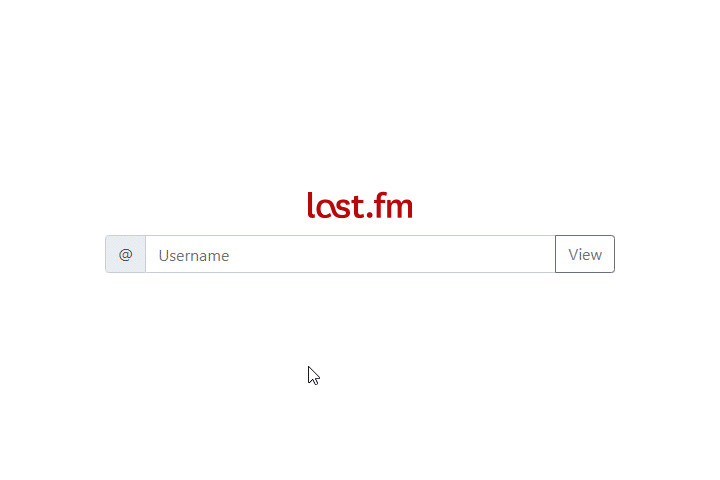

#  mateuszjanczak/lastfm
[](https://travis-ci.org/laravel/lumen-framework)
[](https://packagist.org/packages/laravel/lumen-framework)
[](https://packagist.org/packages/laravel/lumen-framework)
[](https://packagist.org/packages/laravel/lumen-framework)
[](https://packagist.org/packages/laravel/lumen-framework)

This app showing recent information from last.fm such as scrobbles, recent tracks and lyrics for the currently playing song. It's built on a Lumen framework!

## Lumen Documentation

Documentation for the framework can be found on the [Lumen website](https://lumen.laravel.com/docs).

## Requirements

PHP >= 7.1.3, OpenSSL PHP Extension, PDO PHP Extension, Mbstring PHP Extension, Curl PHP Extension, Composer

## Demo

https://mj-lastfm.herokuapp.com/ (wait for heroku to get up)

## Installation and configuration

Clone the repository and set all important variables in ".env". An example settings file can be found in ".env.example"

Next use
```
composer install
```

## Usage



## API keys and cookies needed (.env)

[LASTFM_API_KEY](https://www.last.fm/api/) |
[GENIUS_API_KEY](https://docs.genius.com/) |
[GENIUS_COOKIE](https://genius.com/login)
